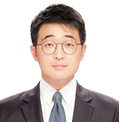

# Principal Investigator

::: {.columns}
::: {.column width="30%"}
{width="100%" .rounded}
:::

::: {.column width="70%"}
### 전유별 (D.V.M., Ph.D)
**Professor of Veterinary Theriogenology** 충남대학교 수의과대학

- **학력** 
 * 충북대학교 수의학 박사
 * 충북대학교 수의학 석사
 * 충북대학교 수의학 학사
- **전문분야:** 배아 이식, 줄기세포 치료
- **이메일:** ybjeon@cnu.ac.kr
:::
:::
